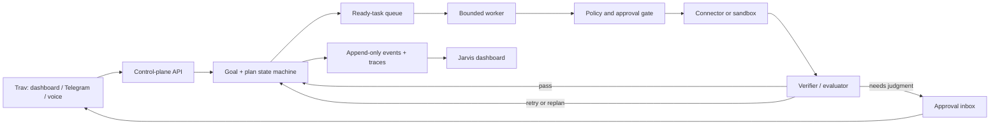

# RESOLVE: personal Jarvis system plan

Status: architecture and control-plane scaffold
Date: 2026-07-10
Scope: personal, single-owner system

## 1. Executive decision

Do not rewrite `telegram_agent.py` in place. It is a working, deployed integration monolith with a
large blast radius. Keep it online as the legacy capability adapter while building a durable control
plane beside it. Migrate one connector and one workflow at a time, then retire the old loop only after
replay tests prove equivalent behavior.

The target system has three planes:

1. **Experience plane**: dashboard, Telegram, voice, notifications, and approval UI.
2. **Control plane**: goals, plans, policies, models, task state, evaluation, budgets, and audit events.
3. **Execution plane**: isolated workers, connector adapters, browser sessions, and coding sandboxes.



## 2. What exists today

`vault1` is already a substantial beta:

- One roughly 398 KB Python file runs the Telegram bot, HTTP dashboard, model loop, schedulers, and
  integrations.
- The current brain is a Claude tool-use loop capped at eight turns and configured through one model
  variable (`CLASSIFIER_MODEL`).
- It has about 60 tool definitions covering calendar, Notion, email, knowledge capture, reminders,
  habits, finance, markets, search, voice, images, and document ingest.
- It deploys as one Render web service. Ten daemon threads run recurring jobs in the same process.
- Durable personal data is split between Notion, Google Calendar, Supabase, and JSON/Markdown files in
  the separate Obsidian vault repository.
- The dashboard is a large HTML/CSS/JavaScript string embedded inside the Python source.
- Confirmations exist for email sending and destructive actions, which is an excellent behavior to
  preserve.

The main architectural constraints are:

- No durable goal, plan, dependency, attempt, or evaluation state.
- Chat history and confirmation state are in memory and disappear on deploy.
- Tools, HTTP routes, UI, scheduling, business logic, and provider calls are tightly coupled.
- Background work has restart supervision but no leases, idempotency ledger, or distributed locking.
- A tool result is trusted as completion; there is no independent verifier or artifact test contract.
- The system uses one general model for nearly every reasoning task.
- Credentials and connector identities are configured inconsistently across direct APIs, service
  accounts, IMAP, and Composio.

## 3. Goal contract

Every autonomous request must become a typed goal before work starts.

Required fields:

- Objective: the desired outcome, not a vague activity.
- Category: school, email, coding, research, project, personal admin, or recurring routine.
- Success criteria: machine-checkable where possible.
- Constraints: deadline, sources, style, repositories, people, excluded actions, and privacy rules.
- Autonomy mode: observe, assist, execute, or autopilot.
- Budgets: dollars, runtime, model calls, tool calls, retries, and replans.
- Allowed connectors and data scopes.
- Approval rules.
- Expected artifacts: report, pull request, calendar update, sent draft, study plan, etc.

Example:

```json
{
  "objective": "Prepare a cited study guide for ECON 2010 chapters 3-5",
  "category": "school",
  "autonomy_mode": "execute",
  "success_criteria": [
    {"description": "All three chapters are represented", "verifier": "coverage_check"},
    {"description": "Every factual claim links to course material", "verifier": "citation_check"},
    {"description": "A 20-question quiz passes schema validation", "verifier": "json_schema"}
  ],
  "constraints": {"do_not_submit_coursework": true},
  "allowed_connectors": ["google.drive", "canvas", "notion"],
  "max_cost_usd": 3,
  "max_runtime_minutes": 30
}
```

## 4. Execution lifecycle

1. **Intake** normalizes the request and detects missing, risky, or contradictory requirements.
2. **Planning** creates a versioned task DAG with a completion test for every task.
3. **Policy compilation** intersects the goal's permissions with the global tool policy.
4. **Scheduling** makes tasks ready only when dependencies have passed.
5. **Claiming** gives one worker a time-limited database lease.
6. **Execution** performs one bounded model/tool step using an idempotency key.
7. **Verification** runs deterministic tests first and an independent model evaluator second.
8. **Recovery** retries transient failures, revises the task, or creates a new plan version.
9. **Approval** pauses the exact pending action with a human-readable preview.
10. **Completion** checks goal-level success criteria, stores artifacts, and issues a concise report.

The worker should never run an unbounded `while model_says_continue` loop. Each invocation performs a
bounded step, commits state, and yields.

## 5. Task families

### School

Inputs: Canvas, Google Drive, PDFs, lecture audio, syllabi, Notion, calendar.
Outputs: study guide, flash cards, quiz, schedule, notes, cited research, assignment checklist.
Boundary: the agent can organize and teach, but submitting graded work requires explicit approval.

Typical DAG: collect sources -> extract -> outline -> synthesize -> citation check -> quiz generation ->
coverage evaluation -> save to Drive/Notion.

### Email and communication

Inputs: Gmail, Outlook, contacts, calendar, prior conversation context.
Outputs: inbox triage, reply drafts, follow-up reminders, approved sends.
Boundary: sending remains approval-gated. Bulk cleanup gets a reversible preview; permanent deletion is
always approval-gated.

### Coding

Inputs: GitHub issue/repository, specifications, tests, logs.
Outputs: branch, commits, test evidence, security scan, draft pull request.
Execution: create an isolated worktree or remote sandbox per goal. The implementer cannot merge its own
work. A separate model reviews the diff and the deterministic test runner is authoritative.

Typical DAG: inspect -> reproduce -> plan -> implement -> format/lint -> unit tests -> integration tests
-> independent review -> repair -> draft PR -> approval to merge/deploy.

### Research

Inputs: web search, papers, primary sources, course materials, saved vault knowledge.
Outputs: evidence table, claims, citations, uncertainty ledger, final report.
Rules: store source URL, title, publication date, retrieval time, and the passage supporting each claim.
The synthesis model only sees collected evidence, not an invitation to fill gaps from memory.

### Projects and personal administration

Inputs: goals, Notion projects, GitHub, calendar, email, Drive.
Outputs: milestones, weekly plans, delegated research, blockers, reminders, and progress reports.
The daily process should inspect active goals, not invent new goals. It may propose work, but expansions
of scope require approval.

## 6. Model routing

Model choices live in `config/model_routes.json`, not inside prompts or tool code. Pin exact model IDs in
production, record the selected model on every run, and review the catalog monthly.

| Work | Primary | Effort | Why |
|---|---|---:|---|
| Routing, spam classification, simple transforms | GPT-5.6 Luna | none/low | Cheap, fast, structured |
| Bulk extraction and summarization | Gemini 3.1 Flash-Lite | low | High-volume multimodal work |
| Normal conversation and tool use | Claude Sonnet 4.6 | medium | Strong speed/intelligence balance |
| Goal planning and hard synthesis | GPT-5.6 Sol | high | Frontier reasoning and long context |
| Broad document/web research | Gemini 3.5 Flash | medium | Long-context multimodal agentic work |
| Coding architecture | Claude Opus 4.8 | high | Complex agentic coding |
| Coding implementation | GPT-5.3-Codex | high | Specialized agentic coding |
| Code review | Claude Opus 4.8 | high | Different model family from implementer |
| High-stakes evaluation | Claude Opus 4.8 | high | Independent critical pass |
| Voice conversation | GPT-Realtime-1.5 | low | Low-latency native audio/tool use |
| Embeddings | text-embedding-3-small | n/a | Existing compatible economical index |

Routing rules:

- Start with the cheapest model capable of passing the task's evals.
- Escalate on task complexity, failed verification, large ambiguous inputs, or high consequence.
- Do not escalate merely because a model produced a long answer.
- The evaluator must not see the implementer's self-assessment as evidence.
- Prefer a different provider/model family for important review.
- Provider fallback is for outages and rate limits, not silent behavior changes.
- Store prompts, model, effort, tokens, latency, cost, and outcome for eval-driven tuning.

## 7. Connectors and public APIs

Use direct OAuth integrations for core personal data. They are more work but give clearer scopes,
revocation, health checks, and predictable tool behavior. Keep Composio for long-tail integrations.

### Tier 1: build first

| Connector | Access | Initial scope | Notes |
|---|---|---|---|
| Google Workspace | OAuth 2.0 APIs | Gmail, Calendar, Drive, Docs, Sheets, Tasks | Replace Gmail app password; use least-privilege scopes |
| Microsoft Graph | OAuth 2.0 | Outlook, Calendar, OneDrive, To Do | One consent surface for Microsoft |
| Notion | Integration/OAuth | Pages, databases, search | Preserve current database mappings initially |
| GitHub | GitHub App | Repos, issues, PRs, checks, Actions | Short-lived installation tokens, per-repo permissions |
| Telegram | Bot API | Commands, files, voice, notifications | Keep as mobile command and approval channel |
| Supabase | Postgres/Storage | Goal state, artifacts, audit events | Existing account can host control-plane data |

### Tier 2: high-value additions

- Canvas LMS: courses, assignments, due dates, announcements, and submissions metadata.
- Search: OpenAI hosted web search first; Exa/Tavily/Brave as configurable alternatives.
- Browser automation: Playwright locally or Browserbase for isolated cloud sessions.
- Coding sandbox: E2B, Daytona, or GitHub Actions for builds and tests.
- Zotero, Crossref, arXiv, Semantic Scholar, and PubMed for academic research.
- Open-Meteo for weather and Google Maps for travel time.
- S3/Supabase Storage for reports, audio, screenshots, and build artifacts.

### Tier 3: optional personal modules

- Slack, Discord, Teams, Linear, Jira, Todoist, Dropbox, Box, and Spotify.
- Plaid for read-only banking aggregation. Never permit autonomous transfers.
- Existing Kalshi integration remains read-only unless every trade is separately approved.
- Home Assistant for home devices, with room/device allowlists and physical-safety restrictions.

All connector tools must declare: risk class, scopes used, timeout, retry behavior, idempotency support,
reversibility window, redaction rules, and a deterministic success probe.

## 8. Permissions and autonomy

Autonomy is a capability envelope, not a personality setting.

| Mode | Allowed behavior |
|---|---|
| Observe | Read and report only |
| Assist | Read, draft, simulate, and propose plans |
| Execute | Reversible writes explicitly requested by the user |
| Autopilot | Bounded recurring/external writes inside a pre-approved policy |

Actions that always require approval:

- Sending email/messages as the user.
- Permanent deletion or broad bulk modification.
- Purchases, transfers, trading, subscriptions, or legal acceptance.
- Merging code, production deployment, permission changes, or secret access.
- Submitting schoolwork or forms.
- Adding a new connector scope.

Every state-changing tool call needs an idempotency key and an audit record. Credentials stay in Render,
Supabase Vault, or a dedicated secret manager; the database stores only a `secret_ref`.

## 9. Data and infrastructure

### Recommended production deployment

- Render web service: FastAPI control-plane API.
- Render background worker: task claimant/executor.
- Render cron or database scheduler: materialize recurring goals.
- Supabase Postgres: authoritative state and event ledger.
- Redis: transient queue notifications, rate limits, and short-lived locks only.
- Supabase Storage or S3: artifacts.
- Existing Render service: legacy Telegram/dashboard adapter during migration.
- GitHub Actions plus an isolated sandbox provider: code verification.

Postgres remains the source of truth. If Redis disappears, ready tasks can be rebuilt from the database.
The schema is in `infra/postgres/001_control_plane.sql`. Local Postgres, Redis, API, and dormant worker
are defined in `infra/docker-compose.yml`.

### Reliability rules

- Workers claim tasks with a lease; expired leases become ready again.
- Side-effect calls use unique idempotency keys.
- Retries use exponential backoff with jitter and distinguish transient from permanent failure.
- Scheduler processes use an advisory lock so only one instance fires a schedule.
- Every goal has cost/time/tool-call limits checked before each step.
- No task is considered successful until its verifier passes.
- Append-only events feed the dashboard and allow replay/debugging.

## 10. Memory

Split memory into explicit classes:

- Profile: durable user facts and preferences, editable in the UI.
- Episodic: past goals, actions, and outcomes.
- Semantic: indexed documents and notes with provenance.
- Procedural: reusable workflows and policies, version-controlled.
- Working: current goal/task context, disposable after completion.

Memory writes should include source, confidence, timestamp, scope, and expiration. The model may propose a
profile fact, but durable preference changes should be visible and reversible. Do not inject the entire
memory file into every prompt; retrieve a small relevant set.

## 11. Jarvis dashboard plan

Build a separate TypeScript web app. Keep the current dashboard running until the replacement covers its
data and actions.

Suggested UI stack: current stable Next.js, React, TypeScript, Tailwind, shadcn/ui primitives, Framer
Motion, TanStack Query, and a small WebGL/canvas layer only for the central visualization. Use server-sent
events first; move to WebSockets only when bidirectional realtime behavior requires them.

### Primary layout

1. **Command core**: centered voice/text orb with live listening, thinking, executing, and waiting states.
2. **Mission rail**: active goals with percent complete, deadline, budget, next action, and blocker.
3. **Agent constellation**: animated nodes for planner, researcher, coder, reviewer, and connectors. Edges
   light up only when real events occur.
4. **Live execution timeline**: human-readable event stream, expandable to traces and raw tool data.
5. **Approval inbox**: exact action preview, risk explanation, diff, recipient, undo window, approve/edit/
   reject controls.
6. **Artifacts dock**: reports, study guides, audio, screenshots, pull requests, and files.
7. **System vitals**: connectors, worker health, model latency, token cost, error rate, and queue depth.
8. **Memory map**: people, projects, courses, documents, and goals with inspect/edit/forget controls.

### Experience principles

- Cinematic, not noisy: dark graphite, deep blue, restrained cyan/amber/red, glass surfaces, and spatial
  depth. Motion communicates state rather than decorating every card.
- Everything important has a plain-language version. A user should understand a failure without logs.
- Voice is first-class, but every voice action is visible as text before execution.
- The system never fakes activity. The animation is driven by real `agent_events`.
- Keyboard command palette and global shortcuts make the dashboard useful even with animations disabled.
- Mobile view emphasizes command core, active mission, approvals, and notifications.
- Respect reduced-motion, contrast, screen readers, and low-power devices.

### Dashboard routes

- `/` command center
- `/goals` portfolio and goal builder
- `/goals/[id]` plan graph, timeline, artifacts, budget, replay
- `/approvals` risk inbox
- `/memory` profile and knowledge controls
- `/connectors` OAuth scopes and health
- `/models` routing, cost, latency, and eval pass rates
- `/labs` prompt/model experiments isolated from production
- `/settings/policies` autonomy modes, budgets, quiet hours, and emergency stop

## 12. Coding guide

Use these boundaries:

```text
apps/dashboard                 user experience only
services/control_plane        goals, policies, scheduling, state transitions
workers                       bounded execution and verification
connectors                     provider-neutral tool interfaces
providers                      OpenAI, Anthropic, and Google model adapters
config                         model routes and permission policy
infra                          database, local compose, deployment definitions
evals                          scenario fixtures, graders, regression thresholds
```

Rules:

- Domain code must not import Telegram, HTTP handlers, or provider SDK response objects.
- Connectors return typed results and normalized errors.
- Model providers return a common envelope but retain raw response metadata for tracing.
- Prompts are versioned files with structured outputs, not giant interpolated strings.
- State transitions occur through one service and produce one audit event.
- Tests mock network boundaries, not domain logic.
- Every connector includes contract tests against recorded sanitized fixtures.
- Every autonomous workflow includes success, ambiguity, timeout, rate-limit, stale-data, and partial-
  failure eval cases.

## 13. Migration roadmap

### Phase 0: freeze and observe — 2 to 3 days

- Add structured logs and capture representative legacy tasks.
- Build a regression set from real Telegram/dashboard requests.
- Record current latency, cost, tool success, and failure modes.
- No behavioral changes to the live bot.

Exit: at least 50 sanitized scenarios with expected tools and outcomes.

### Phase 1: control-plane foundation — 4 to 7 days

- Apply the database schema.
- Implement goal/task repositories, state transitions, leases, and append-only events.
- Add API endpoints for goal creation, inspection, pause, cancel, and emergency stop.
- Implement policy evaluation and approval persistence.

Exit: a fake connector can complete, retry, pause, resume, and fail a goal deterministically.

### Phase 2: provider router and evaluation — 4 to 7 days

- Add direct OpenAI, Anthropic, and Gemini adapters.
- Implement model-role routing, budgets, fallbacks, tracing, and cost accounting.
- Add deterministic verifiers and independent model evaluation.

Exit: eval suite demonstrates when cheap models pass and when escalation is justified.

### Phase 3: legacy capability bridge — 1 to 2 weeks

- Wrap calendar, Notion tasks, vault search, and email drafts behind connector interfaces.
- Route new goals to the control plane while ordinary chat stays on the legacy loop.
- Move in-memory approvals and reminders into Postgres.

Exit: calendar/task/email-draft workflows pass replay tests with no data loss.

### Phase 4: coding and research agents — 1 to 2 weeks

- Add GitHub App and sandbox lifecycle.
- Implement branch/worktree isolation, test runner, artifact capture, reviewer, and PR creation.
- Build evidence ledger, citation verifier, and research report workflow.

Exit: agent fixes a seeded bug and produces a draft PR that passes tests and independent review.

### Phase 5: Jarvis dashboard — 2 to 3 weeks

- Build the design system and command core.
- Add goals, event stream, approvals, artifacts, connectors, models, and vitals.
- Wire SSE to real audit events and add voice input.

Exit: every autonomous action can be understood, paused, approved, or stopped from the dashboard.

### Phase 6: autopilot — gradual

- Enable one recurring workflow at a time: briefing, inbox triage, study planning, project review.
- Start in shadow mode, then proposal mode, then bounded execution.
- Promote only after a defined pass rate and zero unapproved high-risk actions.

## 14. First production goals

Build these in order:

1. Daily agenda and inbox triage, read-only.
2. School source collector and study-guide generator.
3. Project weekly review with proposed next actions.
4. Research report with evidence ledger and citation checks.
5. Coding bug-fix agent that only opens draft PRs.
6. Email follow-up drafts with explicit send approval.

Avoid autonomous purchasing, trading, broad deletion, production deployment, and school submission until
the control plane has months of reliable audit data.

## 15. Definition of done

The system is meaningfully autonomous when it can:

- Resume a goal after a deploy without losing state.
- Explain what it is doing, why, and under which permission.
- Prove completion through tests or explicit criteria.
- Detect failure, retry safely, replan within budget, and stop at the correct boundary.
- Never repeat an external side effect after a retry.
- Ask for approval with an exact preview when required.
- Show a complete audit trail and artifact set in the dashboard.
- Use cheaper models for routine work and reserve frontier reasoning for tasks that benefit from it.
